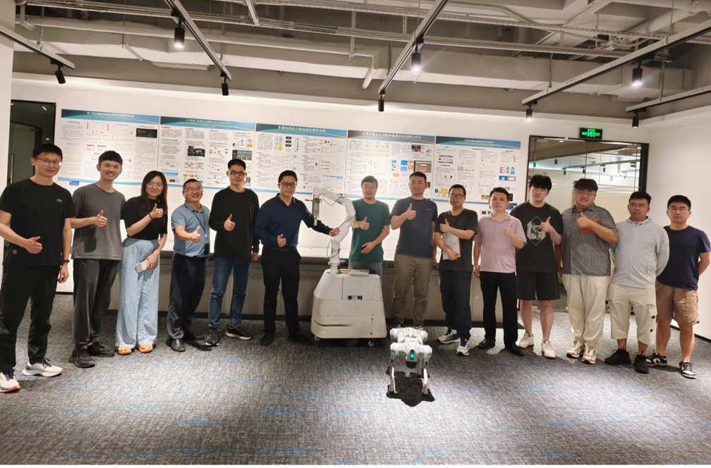

## 多智能体与具身智能研究所简介

多智能体与具身智能研究所隶属于鹏城实验室网络智能研究部，所长为林倞教授，团队成员多元化，已经形成了包括全职、双聘、访问学者、联培博士生等在内近30人团队。团队核心成员均拥有在海内外知名高校学习、工作的经历, 并在人工智能、多模态大数据分析、嵌入式系统及机器人领域取得显著成果。研究所以人工智能前沿技术探索、以及原创技术引领产业发展为导向，依托鹏城云脑、中国算力网等鹏城实验室主导研发的自主可控基础设施，重点突破智能体视角下的多模态感知与生成、智能体任务生成与规划、多智能体的通讯协作与联合决策、具身智能体的控制与人机共融、智能体评测机制与体系等几大方向开展研究，致力于打造多智能体协同与仿真训练平台、云端协同具身多模态大模型等通用基础平台。相关课题将涵盖从基础理论到实际应用的全方位内容，旨在通过领域合作研究，解决现实世界中的复杂智能体问题，支撑智能制造、工业物联网、无人自主系统、机器人系统在内的多个场景的规模化产业应用。现阶段，研究所发展迅速、人员构成多元化，已经形成了包括全职、双聘、访问学者、联培博士生等在内近30人团队。团队核心成员均拥有在海内外知名高校工作、学习的经历。

代表性成果（1）：携手国内知名高校及科创企业共同打造国内首个大规模、多模态，并且涵盖多个场景、技能、任务、平台类型的具身智能数据集ARIO（All Robots In One）。

代表性成果（2）：深度参与具身智能技术国家标准和国际标准制定工作，牵头《具身智能虚实融合训练系统设计规范》、《具身智能多模态感规控开源数据结构规范》等标准制定工作，参与《人工智能人形机器人成熟度分级》、《人工智能具身智能系统技术规范》、《具身智能数据采集规范》等多项国家标准制定工作。

代表性成果（3）：初步建立了基于Gazebo、Mujoco、Isaac等开源工具的具身智能虚实融合训练系统，并在该类工具中对松灵机器人、Aloha机器人等实体设备和虚拟模型进行虚实融合交互控制、采集数据，下一步将开展虚实融合模型训练和模型验证等工作，实现城市级的具身智能虚实融合训练平台。