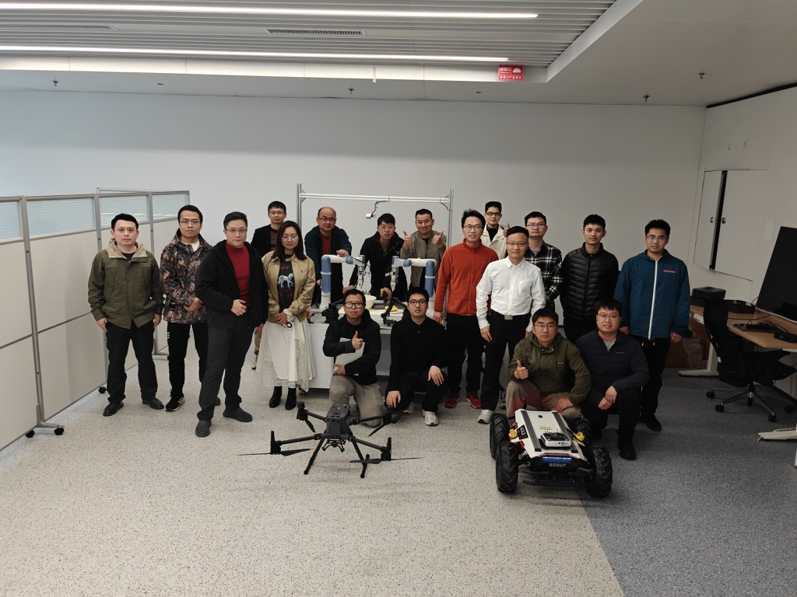
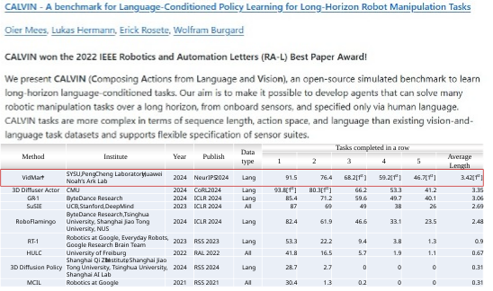
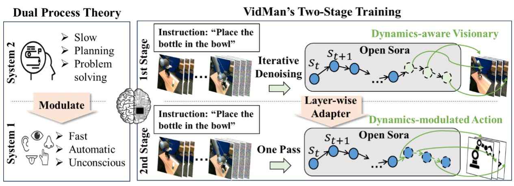
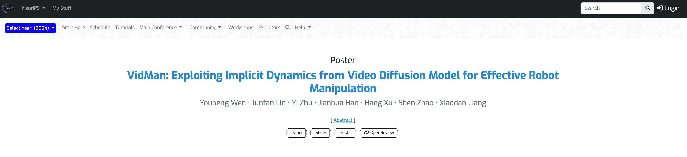


# 多智能体与具身智能研究所简介

多智能体与具身智能研究所隶属于鹏城实验室网络智能研究部，所长为林倞教授，团队成员多元化，已经形成了包括全职、双聘、访问学者、联培博士生等在内近30人团队。团队核心成员均拥有在海内外知名高校学习、工作的经历, 并在人工智能、多模态大数据分析、嵌入式系统及机器人领域取得显著成果。研究所以人工智能前沿技术探索、以及原创技术引领产业发展为导向，依托鹏城云脑、中国算力网等鹏城实验室主导研发的自主可控基础设施，重点突破智能体视角下的多模态感知与生成、智能体任务生成与规划、多智能体的通讯协作与联合决策、具身智能体的控制与人机共融、智能体评测机制与体系等几大方向开展研究，致力于打造多智能体协同与仿真训练平台、云端协同具身多模态大模型等通用基础平台。相关课题将涵盖从基础理论到实际应用的全方位内容，旨在通过领域合作研究，解决现实世界中的复杂智能体问题，支撑智能制造、工业物联网、无人自主系统、机器人系统在内的多个场景的规模化产业应用。

代表性成果（1）：携手国内知名高校及科创企业共同打造国内首个大规模、多模态，并且涵盖多个场景、技能、任务、平台类型的具身智能数据集ARIO（All Robots In One）。

代表性成果（2）：深度参与具身智能技术国家标准和国际标准制定工作，牵头《具身智能虚实融合训练系统设计规范》、《具身智能多模态感规控开源数据结构规范》等标准制定工作，参与《人工智能人形机器人成熟度分级》、《人工智能具身智能系统技术规范》、《具身智能数据采集规范》等多项国家标准制定工作。

代表性成果（3）：初步建立了基于Gazebo、Mujoco、Isaac等开源工具的具身智能虚实融合训练系统，并在该类工具中对松灵机器人、Aloha机器人等实体设备和虚拟模型进行虚实融合交互控制、采集数据，下一步将开展虚实融合模型训练和模型验证等工作，实现城市级的具身智能虚实融合训练平台。



# 新闻 Latest News

## 鹏城实验室联合中山大学发布具身智能新成果VidMan 刷新具身智能CALVIN榜单最佳成绩(2025-1-21)

近日，鹏城实验室与中山大学等联合开展对具身智能多模态感知-规划-控制一体的研究并攻克了具身智能数据利用效率低下的难题，同步在基于“中国算力网”的大规模高速运算集群“鹏城云脑”上实现了最新的具身智能领域学术成果——VidMan（Video Diffusion Model for Robot Manipulation）具身智能操控模型，该模型通过结合人类双程认知过程以及视频扩散生成模型Open-Sora，能够提升动作估计的精度和抓取成功率，强化预测未来图像的能力。该模型目前已在具身智能主流榜单CALVIN零次学习长程任务中夺得最佳表现。
 

  

图1.VidMan模型在CALVIN零次学习长程任务的榜单中取得最佳成绩。

当前，缺乏大规模、高质量、多模态的开源数据集，是制约具身智能领域发展的重要因素。而最近的研究工作Open-Sora表明，利用大规模在线视频数据训练的视频扩散生成模型，在理解和预测长序列现实世界复杂物理动态方面具有巨大潜力。为此，鹏城实验室联合中山大学、华为诺亚方舟实验室等创造性地提出了一种基于视频扩散生成模型的机械臂操控模型VidMan，切实解决了训练具身大模型的数据来源的瓶颈问题。
该模型能够挖掘视频扩散生成模型学习的隐式物理世界规律，将动作估计建模成为视频帧之间的逆动力学过程，并基于双程认知理论提出双阶段训练策略，将视频扩散生成模型转换于指导下游机器人控制，显著提高机器人动作预测准确性和任务完成表现（如图2所示）。

图2. 人类双程认知过程和VidMan的对应关系。

图3. VidMan论文被国际顶级会议NeurIPS 2024接收并发表。

VidMan已在CALVIN榜单任务中超过了谷歌RT-1-X、字节跳动GR-1以及卡内基梅隆大学3D Diffuser Actor等世界先进模型（如图1所示）。同时，该模型和有关方法已被国际顶级学术会议NeurIPS 2024接收并发表[https://neurips.cc/virtual/2024/poster/94687](https://neurips.cc/virtual/2024/poster/94687)。

VidMan现已在OpenI启智社区开源。更多关于VidMan的内容，请访问启智社区项目主页：[https://openi.pcl.ac.cn/Code_library_of_IMAEI/VidMan](https://openi.pcl.ac.cn/Code_library_of_IMAEI/VidMan)。
